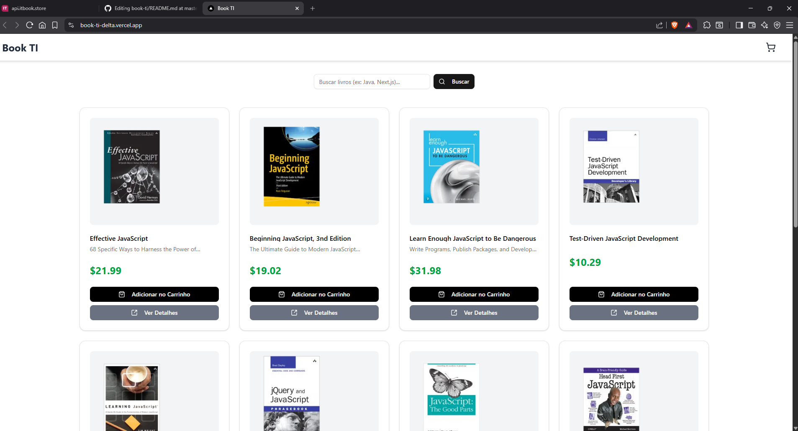

# Book TI — E-commerce de Livros Técnicos

Aplicação web desenvolvida para simular um e-commerce focado em livros de tecnologia. O projeto consome a [IT Book Store API](https://api.itbook.store/) e demonstra a implementação de padrões modernos de desenvolvimento frontend, focando em performance, otimização de renderização e gerenciamento de estado complexo.

## 📋 Visão Geral

O objetivo deste projeto foi explorar o ecossistema do **Next.js (App Router)** em conjunto com bibliotecas de gerenciamento de estado e interface de usuário. A aplicação trata desafios reais de frontend, como:

- Cacheamento e revalidação de dados server-side.
- Gerenciamento de estado global no client-side (Carrinho de compras).
- UI/UX responsiva com feedback visual (Skeletons, Toasts).
- Tratamento de erros e estados vazios.

## 🛠 Tech Stack

A arquitetura foi construída utilizando as seguintes tecnologias:

### Core
- **Framework:** Next.js 14+ (App Router)
- **Linguagem:** TypeScript
- **Estilização:** Tailwind CSS

### State Management & Data Fetching
- **Client State:** Zustand (Persistência e manipulação do carrinho)
- **Server State:** TanStack Query (React Query) para caching e sincronização com a API

### UI Components
- **Library:** Shadcn UI 
- **Ícones:** Lucide React

## ✨ Funcionalidades Principais

1.  **Catálogo de Produtos:**
    - Listagem de livros com paginação e busca em tempo real.
    - Implementação de *Skeleton Loading* para melhor percepção de performance (LCP).

2.  **Detalhes do Produto (Dynamic Routing):**
    - Páginas estáticas e dinâmicas geradas com base no ISBN do livro.
    - Carrossel de recomendações baseado em contexto.

3.  **Carrinho de Compras (Side-Sheet):**
    - Painel lateral deslizante (Drawer) acessível de qualquer rota.
    - Persistência de dados locais.
    - Cálculos automáticos de subtotal e formatação de moeda (BRL).

4.  **Tratamento de Erros:**
    - Componentes de *fallback* para falhas de API e resultados vazios.
    - Sanitização de dados vindos da API (parsing de preços e strings).

## Link do Projeto Deployado
 [Book T.i](https://book-ti-delta.vercel.app/) 
